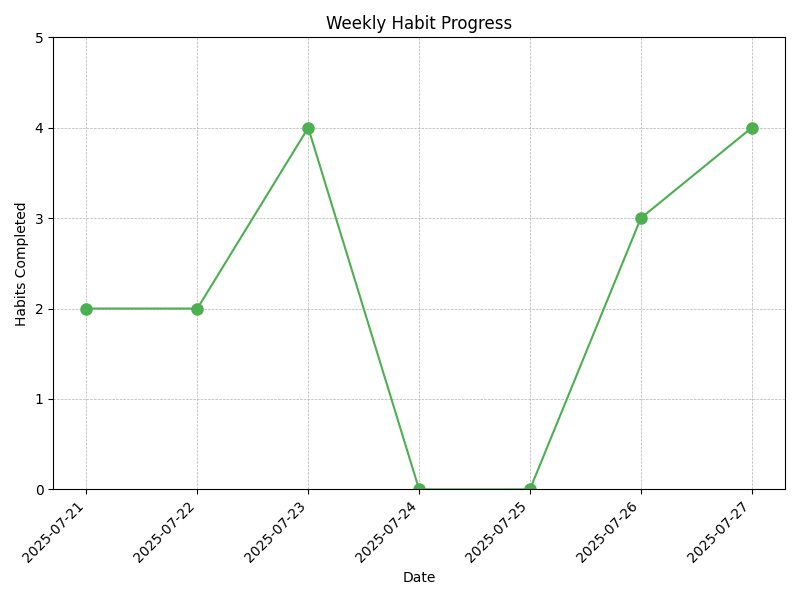

# Habit-Tracker



A simple command-line habit tracking application.

## Features

- Track daily habits
- Store habit data in a JSON file

## Prerequisites

Before you begin, ensure you have met the following requirements:
- Python 3.x installed on your system.

## Setup

1.  **Clone the repository:**

    ```bash
    git clone https://github.com/YOUR_USERNAME/Habit-Tracker.git
    cd Habit-Tracker
    ```

2.  **Create and activate a virtual environment:**

    - For Windows:
        ```bash
        python -m venv .venv
        .venv\Scripts\activate
        ```

    - For macOS and Linux:
        ```bash
        python3 -m venv .venv
        source .venv/bin/activate
        ```

3.  **Install dependencies:**
    ```bash
    pip install -r requirements.txt
    ```

## Usage

To run the habit tracker, navigate to the project directory and execute the `main.py` script:

```bash
python main.py
```

## File Structure

- `main.py`: The main application script.
- `habits.json`: Stores your habit data.

## Contributing

Contributions are what make the open source community such an amazing place to learn, inspire, and create. Any contributions you make are **greatly appreciated**.

1.  Fork the Project
2.  Create your Feature Branch (`git checkout -b feature/AmazingFeature`)
3.  Commit your Changes (`git commit -m 'Add some AmazingFeature'`)
4.  Push to the Branch (`git push origin feature/AmazingFeature`)
5.  Open a Pull Request

## License

Distributed under the MIT License. See `LICENSE` for more information.
